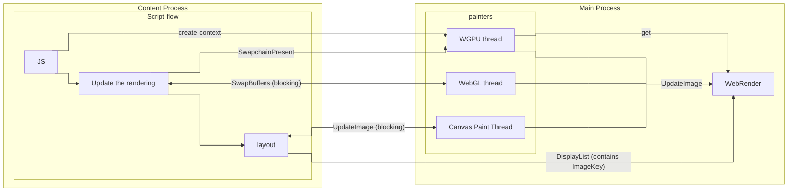

# Canvas

Servo supports 4 types of canvas context:

- 2d
- WebGL
- WebGL2
- WebGPU

Each canvas context implements [`CanvasContext` trait](https://github.com/servo/servo/blob/4f8d816385a5837844a3986cda392bb6c0464fe6/components/script/canvas_context.rs#L26) that requires context to implement some common features in unified way (`resize`, `get_image_data`, ...) while also providing some good default implementations (`onscreen`, `origin_is_clean`, `size`). Each canvas context also implements [LayoutCanvasRenderingContextHelpers](https://github.com/servo/servo/blob/4f8d816385a5837844a3986cda392bb6c0464fe6/components/script/canvas_context.rs#L17), that allows obtaining `HTMLCanvasDataSource` for layout.

Each canvas context can work with both onscreen and offscreen canvas (`OffscreenCanvasOrHTMLCanvasElement`).

## HTML event loop and Rendering

As part of HTML event loop script thread first run some JS (microtasks) in part of witch it also runs [`update the rendering`](https://html.spec.whatwg.org/multipage/webappapis.html#update-the-rendering), that updates the rendering of onscreen canvases and then runs [`run the animation frame callbacks`](https://html.spec.whatwg.org/multipage/imagebitmap-and-animations.html#run-the-animation-frame-callbacks) and then reflow that triggers (re)layout.

On each canvas context creation we await for painter to initialize it's stuff and return `ImageKey` that will be used for rendering. On each layout canvas context returns it's `ImageKey` that is embedded into `DisplayList` (final product of layout) that is sent to WebRender. WebRender will read actual data based from appropriate . In webgl and webgpu painters this is done by implementing custom `WebrenderExternalImageApi`, that provides `lock`/`unlock` methods for WebRender to obtain actual image data, while in 2d canvas image data is directly inserted on `CreateImage` and `UpdateImage`.

We use `ExternalImageId` generator from WR to use it as WebGPU/WebGL context id, so WR knows which external image handler to use.

### shared/webrender for WR

# 2d canvas

## Resources

- <https://medium.com/@polyglot_factotum/fixing-servos-event-loop-490c0fd74f8d>
- <https://github.com/servo/servo/issues/35733>