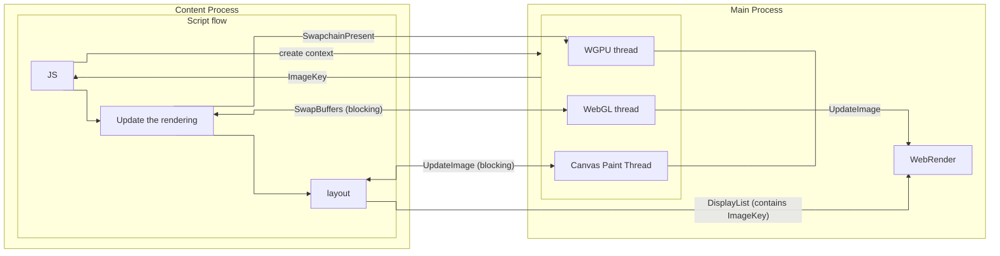

# Canvas

Servo supports 4 types of canvas context:

- 2d
- WebGL
- WebGL2
- WebGPU

Each canvas context implements [`CanvasContext` trait](https://github.com/servo/servo/blob/4f8d816385a5837844a3986cda392bb6c0464fe6/components/script/canvas_context.rs#L26) that requires context to implement some common features in unified way (`resize`, `get_image_data`, ...) while also providing some good default implementations (`onscreen`, `origin_is_clean`, `size`). Each canvas context also implements [LayoutCanvasRenderingContextHelpers](https://github.com/servo/servo/blob/4f8d816385a5837844a3986cda392bb6c0464fe6/components/script/canvas_context.rs#L17), that allows obtaining `HTMLCanvasDataSource` for layout.

## HTML event loop

As part of HTML event loop script thread first run some JS (microtasks) in part of witch it also runs [`update the rendering`](https://html.spec.whatwg.org/multipage/webappapis.html#update-the-rendering), that updates the rendering of onscreen canvases and then runs [`run the animation frame callbacks`](https://html.spec.whatwg.org/multipage/imagebitmap-and-animations.html#run-the-animation-frame-callbacks) and then reflow that triggers (re)layout.

## Resources

- <https://medium.com/@polyglot_factotum/fixing-servos-event-loop-490c0fd74f8d>
- <https://github.com/servo/servo/issues/35733>